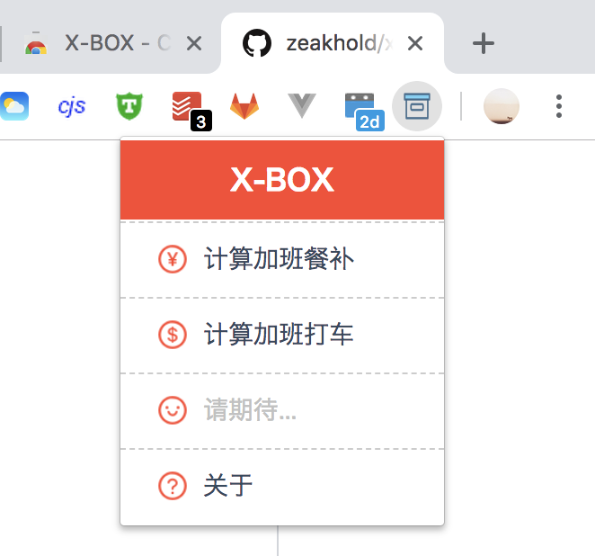
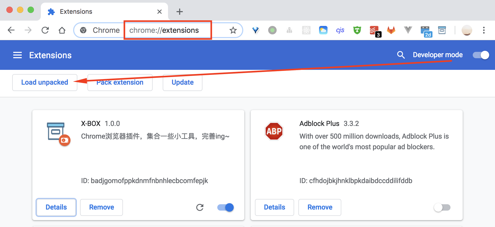

# X-BOX工具箱 :sunny: 
[](https://codeload.github.com/zeakhold/chrome-extension/zip/master) [](https://chrome.google.com/webstore/detail/x-box/ghjnofmahfaomccknicfliidomnmimdd) 
 
Chrome浏览器插件，集合一些小工具，完善ing~




## TODO

- [x] 加班餐补计算功能
- [x] 加班打车计算功能
- [x] 自动化打包成zip（供上传Chrome Web Store）
- [ ] ~~source代码仓库树形展开~~(安全原因废弃)
- [ ] （陆续添加中...）


## 安装插件
前往[Chrome Web Store](https://chrome.google.com/webstore/detail/x-box/ghjnofmahfaomccknicfliidomnmimdd) 安装<X-BOX工具箱>

    

## 开发插件
1. 下载[本项目](https://github.com/zeakhold/x-box/repository/master/archive.zip)到电脑中
2. 浏览器地址栏输入：`chrome://extensions/`
3. 勾上“Developer mode”开发者模式
4. 点击“Load unpacked extension...”按钮
5. 在弹出的选择框中选中本项目所在文件夹即可进入开发模式




## 打包插件
```
    npm run build
```
在根目录生成xxx.zip，即可上传Chrome Web Store
